#### 历年真题

[2023上半年](https://www.cnitpm.com/pm1/140332.html)	[2023下半年](https://moodle.scnu.edu.cn/pluginfile.php/1255102/mod_resource/content/1/2023%E5%B9%B4%E4%B8%8A%E5%8D%8A%E5%B9%B4%E4%B8%8B%E5%8D%88%E8%AF%95%E9%A2%98.pdf)

[2022下半年上午题](https://www.cnitpm.com/pm1/140332.html)	[2022下半年下午题](https://www.cnitpm.com/pm1/130567.html)

[2021上半年](https://www.cnitpm.com/pm1/103386.html)	[2021下半年](https://www.cnitpm.com/pm1/103388.html)


#### 知识点

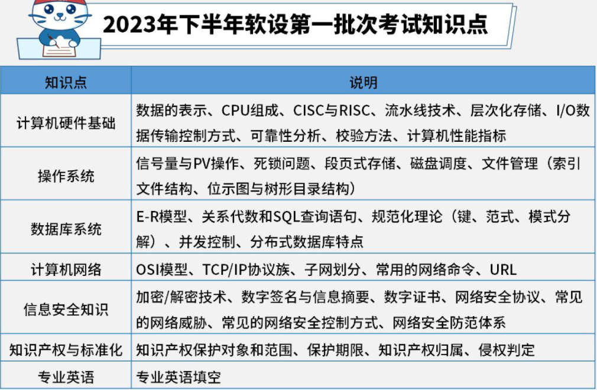

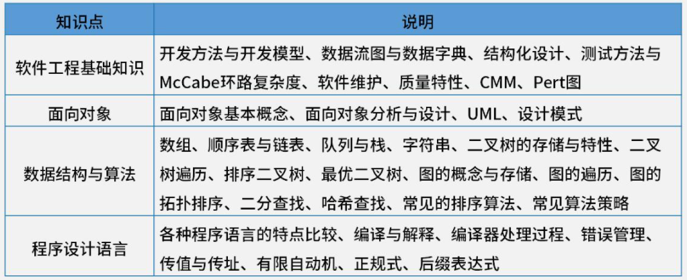

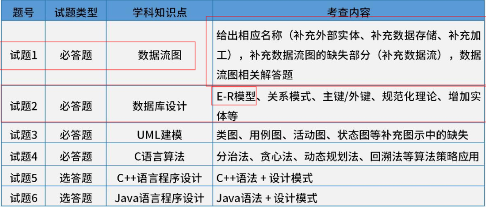

[1周通关](https://www.bilibili.com/video/BV1Mo4y1w7Gu/?spm_id_from=333.788&vd_source=dc7d6bd03a40150908a5bcfa500bb121)  [32小时通关](https://www.bilibili.com/video/BV1mL411j7bq/?spm_id_from=333.788.recommend_more_video.1&vd_source=dc7d6bd03a40150908a5bcfa500bb121)      ~~迷信一波QwQ~~

#### 考情

**！！**

**考试时候，先点击右下角的小齿轮，把“手动切换到下一题”切换成“自动切换到下一题”**

**有的题不确定，先点击标记，再选择选项**

**切换到问答题，也要先切换成“自动切换到下一题”**

**画图题，如果需要特殊的字符，点击右下角的特殊字符，可以选想要的进行复制**

**只需要流程图里面的菱形，线条类里面的直线，基础类里面的**

**！！**


[考点精讲](https://www.bilibili.com/video/BV1Qc411G7fB/?spm_id_from=333.788.recommend_more_video.5&vd_source=dc7d6bd03a40150908a5bcfa500bb121)

#### 数据的表示-原/反/补/移码

原码：最高位是符号位，其余低位表示数值的绝对值

反码：正数的反码与原码相同，负数的反码是其绝对值按位取反（符号位不变）

补码：正数的补码与原码相同，负数的补码是其反码末位加1（符号位不变）

移码：补码的符号位按位取反

| 码制 | 数值1     | 数值-1    | 1-1                                   |
| ---- | --------- | --------- | ------------------------------------- |
| 原码 | 0000 0001 | 1000 0001 | 1000 0010即-2                         |
| 反码 | 0000 0001 | 1111 1110 | 1111 1111即-0                         |
| 补码 | 0000 0001 | 1111 1111 | 0000 0000即+0                         |
| 移码 | 1000 0001 | 0111 1111 | 1000 0000这里的规则较特殊，不要求掌握 |

> 1是正数，反码/补码与原码相同，移码改变补码符号位
>
> -1是负数，最高位是符号位1，反码是除符号位，负数的反码=补码+1，移码改变补码符号位
>
> 用原码计算1-1不准确，所以计算机不用原码计算，而用补码。

| 码制 | 定点整数                | 定点小数                      | 数码个数 |
| ---- | ----------------------- | ----------------------------- | -------- |
| 原码 | -(2^n-1^-1)~+(2^n-1^-1) | -(1-2^-(n-1)^)~+(1-2^-(n-1)^) | 2^n^-1   |
| 反码 | -(2^n-1^-1)~+(2^n-1^-1) | -(1-2^-(n-1)^)~+(1-2^-(n-1)^) | 2^n^-1   |
| 补码 | -2^n-1^~+(2^n-1^-1)     | -1~+(1-2^-(n-1)^)             | 2^n^     |
| 移码 | -2^n-1^~+(2^n-1^-1)     | -1~+(1-2^-(n-1)^)             | 2^n^     |

**定点整数：**当n=8，也就是一共8个数位时：

原码：-127~+127

转为二进制：1111 1111~0111 1111

补码：1000 0000~0111 1111

其中-128的补码为1000 0000是人为规定的

**定点小数：**当n=8，也就是一共8个数位时：

原码：-0.11111111~+0.1111111

补码：-1~+0.1111111

其中-1的补码为1000 0000是人为规定的

> ```tex
> 如果“2X”的补码是“90H”，那么X的真值是（B）.
> A.72  B.-56  C.56  D.111
> 
> 90H（补）转换成二进制为1001 0000（补）
> 反码+1=补码，补码-1=反码，转换成反码为1000 1111（反）
> 转换成原码为1111 0000（原）
> 
> （求到这里就知道2X是负数，即X是负数了，选B）
> 
> 1111 0000写成十进制是-(16+32+64)=-2*56，选B
> ```

#### 浮点的运算

浮点数表示：N=尾数\*基数^指数^

> 其中，尾数是定点小数；指数也叫阶码，是定点整数
>
> 数符：尾数部分的符号位
>
> 阶符：阶码的符号位

运算过程：对阶->尾数计算->结果格式化

特点：

1.一般尾数用**补码**，阶码用移码，IEEE754的尾数用移码

2.**阶码的位数**决定数的**表示范围**，位数越多范围越大

3.**尾数的位数**决定数的**有效精度**，位数越多精度越高

4.对阶时，**小数向大数看齐**

5.对阶是通过**较小数的尾数右移**实现的（算术右移）

> ```tex
> 设16位浮点数，其中阶符1位、阶码值6位、数符1位、尾数8位。若阶码用移码表示，尾数用补码表示，则该浮点数所能表示的数值范围是（B）。
> ```
>
> A.-2^64^~(1-2^-8^)2^64^					B.-2^63^~(1-2^-8^)2^63^
> C.-(1-2^-8^)2^64^~(1-2^-8^)2^64^		D.-(1-2^-8^)2^63^~(1-2^-8^)2^63^
>
> ```tex
> 阶码：n=7，定点整数移码，-2^n-1^~+(2^n-1^-1)=-64~+63
> 尾数：n=9，定点小数补码，-1~+(1-2^-(n-1)^)=-1~+(1-2^-8^)
> ```

#### 运算顺序

非(!) > 算术运算(\*/+-) > 关系运算(><=!=) > 逻辑运算(与&或|)

#### 校验码

码距：任何一种编码都由许多码字构成，任何两个码字之间最少变化的二进制位数就成为数据校验码的码距。

例如，用4位二进制表示16种状态，则有16个不同的码字，此时码距为1。如0000与0001。

#### 奇偶校验

奇偶校验码的编码方法是：由若干位有效信息（如一个字节），再加上一个二进制位（校验位）组成校验码。

> 校验码=信息位+校验位

奇校验：整个校验码（有效信息位和校验位）中“1”的个数为奇数。

偶校验：整个校验码（有效信息位和校验位）中“1”的个数为偶数。

**奇偶校验，可检查1位（奇数位）的错误，不可纠错。即——若有奇数个数据位出错，则可以检测出该错误但无法纠正错误。**

#### 循环校验码CRC

CRC的编码方法是：在k位信息吗之后拼接r位校验码，称为生成多项式。应用CRC码的关键是如何从k位信息位简便地得到r位校验位（编码），以及如何从k+r位信息码判断是否出错。

把接收到的CRC码用约定的生成多项式G(x)去**除（模2除法）**，如果正确，则余数为0；如果某一位出错，则余数不为0。不同的位数出错其余数不同，余数和出错位序号之间有唯一的对应关系。

**CRC校验，可检错，不可纠错。**

#### 海明校验码

海明校验码的原理是：在有效信息位中加入几个校验位形成海明码，使码距比较均匀地拉大，并把海明码的每个二进制位分配到几个奇偶校验组中。当某一位出错后，就会引起有关的几个校验位的值发生变化，这不但可以发现错误，还能指出错误的位置，为自动纠错提供了依据。

**海明校验，可检错，也可纠错。**

$2^r\ge m+r+1$，r为校验位，m为数据的位

|                 | 校验码位数               | 校验码位置       | 检错         | 纠错     | 校验方式                                                   |
| --------------- | ------------------------ | ---------------- | ------------ | -------- | ---------------------------------------------------------- |
| 奇偶校验        | 1                        | 一般拼接在头部   | 可检奇数位错 | 不可纠错 | 奇校验：最终1的个数是奇数个；偶校验：最终1的个数是偶数个； |
| CRC循环冗余校验 | 生成多项式由最高次幂决定 | 拼接在信息位尾部 | 可检错       | 不可纠错 | 模2除法求余数，拼接作为校验位                              |
| 海明校验        | 2^r^≥m+r+1               | 插入在信息为中间 | 可检错       | 可纠错   | 分组奇偶校验                                               |

> ```tex
> 以10位数据为例，其海明码表示D9D8D7D6D5D4P4D3D2D1P3P0P2P1中，其中Di表示数据位，Pj表示校验位，数据位D9由P4、P3和P2进行校验（从右至左D9的次序为14，即等于8+4+2，因此用第8位的P4、第4位的P3和第2位的P2校验），数据位D5由（B）进行校验。
> A.P4P1 B.P4P2 C.P4P3P1 D.P3P2P1
> 
> 找规律题：
> D9 D8 D7 D6 D5 D4 P4 D3 D2 D1 P3 P0 P2 P1
> 14 13 12 11 10  9  8  7  6  5  4  3  2  1
> 14=8+4+2，故D9=P4+P3+P2
> 10=8+2，故D5=P4+P2
> ```

#### 计算机结构

```tex
____________________________________________________________
|                                                      外设 |
|               _________________________                  |
|               |  辅助存储器（辅存/外存）  |                  |
|    输入设备    |                       |         输出设备   |
|               |                       |                  |
L_______________|_______________________|__________________|
                | 存储器                 |
________________|_______________________|___________________
|               |                       |              主机 |
|               |    主存储器（主存/内存） |                   |
|               L_______________________|                  |
|                                                          |  运算器包括：算术逻辑单元ALU、累加寄存器、
|          ___________________________________             |            数据缓冲寄存器、状态条件寄存器
|          |   运算器                  控制器   |            |  控制器包括：程序计数器PC、指令寄存器IR、
|          |                                  |            |            指令译码器、时序部件
|          LCPU_______________________________|            |  注意：有时候状态条件寄存器也会归在控制器里面
L__________________________________________________________|
```

运算器

①算术逻辑单元ALU：数据的算术运算和逻辑运算

②累加寄存器AC：通用寄存器，为ALU提供一个工作区，用在暂存数据

③数据缓冲寄存器DR：写内存时，暂存指令或数据

④状态条件寄存器PSW：存状态标志与控制标志（争议：也有将其归为控制器的）

控制器

①程序计数器PC：存储下一条要执行的指令（的地址）

②指令寄存器IR：存储即将执行的指令

③指令译码器ID：对指令中的操作码字段进行分析解释

④时序部件：提供时序控制信号

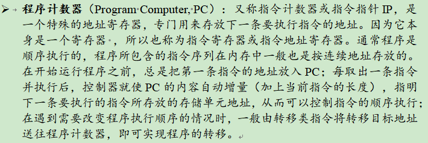

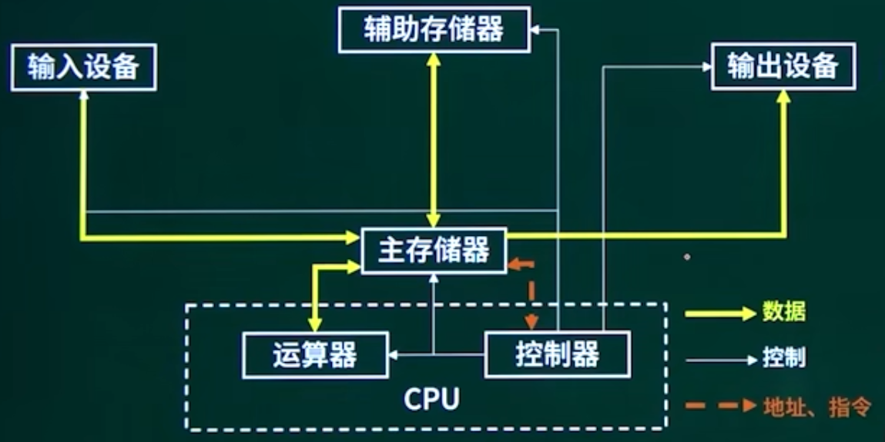

#### CPU结构

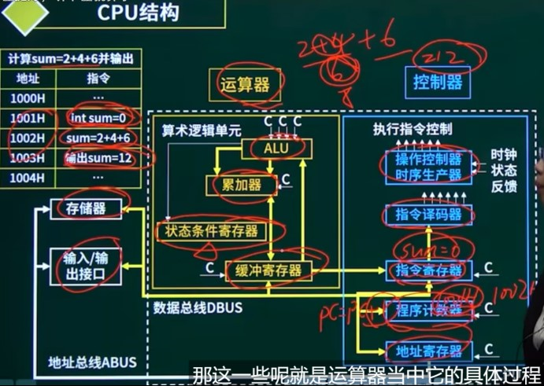

#### 指令

一条指令就是机器语言的一个语句，它是一组有意义的二进制代码，指令的基本格式：

$\fbox{操作码字段}$$\fbox{地址码字段}$

​     MOV           ADD   JMP

   $\fbox{OP}$$\fbox{A1}$$\fbox{A2}$

#### 寻址方式

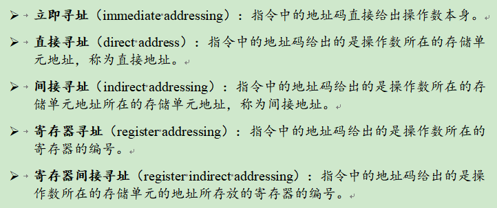

立即寻址方式——立即数            IR $\fbox{OP}$$\fbox{操作数}$

特点：操作数直接在指令中，速度快，灵活性差

---

​                                                                                主存储器

​                                                                                   $\fbox{\qquad}$

直接寻址方式                       IR $\fbox{OP}$$\fbox{直接地址}$-->$\fbox{操作数}$

​                                                                                   $\fbox{\qquad}$

特点：指令中存放的是操作数的地址

---

​                                                                                                             主存储器

​                                                                                                              $\fbox{\qquad}$

间接寻址方式                                              IR $\fbox{OP}$$\fbox{间接地址}$-->$\fbox{操作数地址}$-----↘

​                                                                                                              $\fbox{\qquad}$             👇

​                                                                                                             $\fbox{操作数}$ <===↙

特点：指令中存放了一个地址，这个地址对应的内容是操作数的地址

---

​                                                                                                       RI

寄存器寻址方式                                              IR $\fbox{OP}$$\fbox{RI}$-->$\fbox{操作数}$

特点：寄存器存放操作数

---

​                                                                                                       RI

寄存器间接寻址方式                                      IR $\fbox{OP}$$\fbox{RI}$-->$\fbox{操作数地址}$--->$\fbox{操作数}$

特点：寄存器内存放的是操作数的地址

以上所有方式，图中有几个地址，就要经过几次访存。

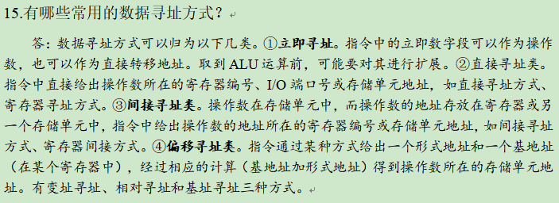

#### 指令系统

| 指令系统类型 | 指令                                                         | 寻址方式   | 实现方式                                             | 其它                       |
| ------------ | ------------------------------------------------------------ | ---------- | ---------------------------------------------------- | -------------------------- |
| CISC（复杂） | 数量多 ，使用频率差别大，可变长格式                          | 支持多种   | 微程序控制技术                                       | 研制周期长                 |
| RISC（精简） | 数量少，使用频率接近，定长格式，大部分为单周期指令，操作寄存器，只有Load/Store操作内存 | 支持方式少 | 增加了通用寄存器；硬布线逻辑控制为主；适合采用流水线 | 优化编译，有效支持高级语言 |

CISC与RISC比较，分哪些维度？

指令数量、指令使用频率，寻址方式，寄存器，流水线支持，高级语言支持

CISC：复杂，指令数量多，频率差别大，多寻址

RISC：精简，指令数量少，操作寄存器，单周期，少寻址，多通用寄存器，流水线

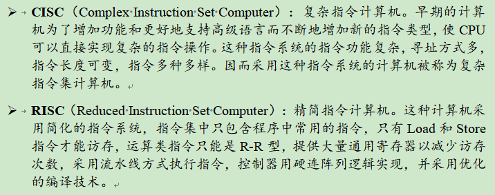

#### 流水线

相关参数计算：流水线执行时间、流水线吞吐率、流水线加速比、流水线效率

流水线是指在程序执行时多条指令重叠进行操作的一种准并行处理实现技术。各种部件同时处理是针对不同指令而言的，它们可同时为多条指令的不同部分进行工作，以提高各部件的利用率和指令的平均执行速度

> 并行，齐头并进
>
> 串行，顺序过程，eg：
>
> ->取指->分析->执行->   取指、分析、执行各1ms，执行三条指令，共9ms
>
> ​          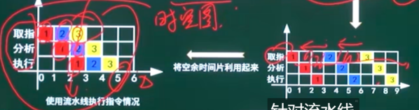
>
> ​                       <--------->|<---------->
> 第1条指令执行时间        每个流水线周期完成
> 流水线建立时间              1条指令

流水线周期为执行时间最长的一段

流水线计算公式为：1条指令执行时间+（指令条数-1）*流水线周期

①理论公式：(t1+t2+...+tk)+(n-1)\*t

②实践公式：k\*t+(n-1)\*t

> 一条指令的执行过程可以分解为取指、分析和执行散步，在取值时间t取指=3Δt、分析时间t分析=2Δt、执行时间t执行=4Δt的情况下，若按穿行方式执行，则10条指令全部执行完需要（90）Δt；若按流水线方式执行，流水线周期为（4）Δt，，则10条指令全部执行完需要（45）Δt。
>
> 第一空：(3+2+4)\*10=90
>
> 第二空：max(3,2,4)=4
>
> 第三空：3+2+4+(10-1)\*4=9+(10-1)\*4=45

#### 流水线吞吐率计算

流水线的吞吐率（Though Put rate,TP）是指在单位时间内流水线所完成的任务数量或输出的结果数量。计算流水线吞吐率的最基本的公示如下：

$TP=\dfrac{指令条数}{流水线执行时间}$

流水线最大吞吐率：

$TP_{max}=\lim\limits_{n\to\infin}\dfrac n{(k+n-1)t}=\dfrac1t$

> 一条指令的执行过程可以分解为取指、分析和执行散步，在取值时间t取指=3Δt、分析时间t分析=2Δt、执行时间t执行=4Δt。10条指令的吞吐率？最大吞吐率？
>
> 第一步：3+2+4+(10-1)\*4=9+(10-1)\*4=45
>
> 第一空：10/45Δt
>
> 第二空：1/4Δt

> ```tex
> 下列关于流水线方式执行指令的叙述中，不正确的是（A）
> A.流水线方式可提高单条指令的执行速度
> B.流水线方式下可同时执行多条指令
> C.流水线方式提高了各部件的利用率
> D.流水线方式提高了系统的吞吐率
> ```

#### 局部性原理

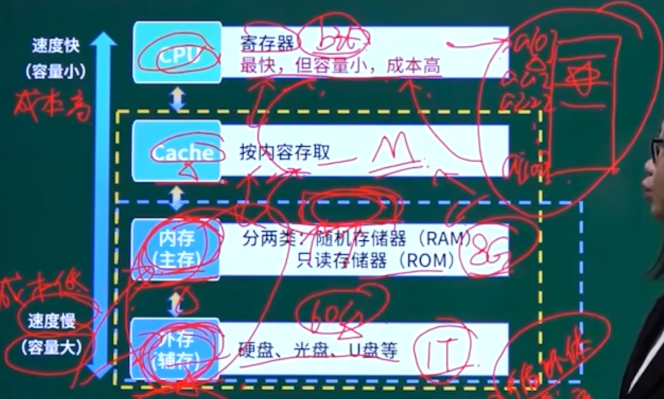

三级存储结构：Cache，主存，外存

> ```tex
> 虚拟存储体系由（主存-赋存）两级存储器组成。
> ```

局部性原理是层次化存储结构的支撑

时间局部性：刚被访问的内容，立即又被访问（循环体）

空间局部性：刚被访问的内容，邻近的空间很快被访问（顺序）

#### 层次化存储结构-分类

1.存储器位置：内存&外村

2.存取方式

（1）按内容存取：相连存储器（如Cache）

（2）按地址存取

随机存取存储器（如内存）、顺序存取存储器（如磁带）、直接存取存储器（如磁盘）

3.工作方式

（1）随机存取存储器RAM（如动态内存DRAM、静态内存SRAM）（掉电丢失）

（2）只读存储器ROM（如BIOS）（掉电保留）

DRAM：动态随机存取存储器

SRAM：静态随机存取存储器

Cache：高速缓存

FEPROM：电可擦可编程只读存储器

#### Cache

在计算机的存储系统体系中，Cache是访问**速度最快的层次**（若有寄存器，则寄存器最快）。

使用Cache改善系统性能的依据是程序的局部性原理。（时间局部性，空间局部性）

如果以h代表对Cache的访问命中率，t1表示Cache的周期时间，t2表示主存储器周期时间，以读操作为例，使用“Cache+主存储器”的系统的平均周期为t3在，则：t3=h\*t1+(1-h)\*t2

其中，(1-h)又称为失效率（未命中率）。

> 若命中率为0.9，共100次，命中需要1ms，不命中需要100ms，则平均周期为90\*1ms+10\*100ms

#### Cache-映像

直接相联映像：硬件电路较简单，但冲突率很高。

全相联映像：电路难于设计和实现，只适用于小容量的cache，冲突率较低。

组相联映像：直接相联与全相联的折中。电路复杂度折中，冲突率折中。

> ```tex
> 主存与Cache之间的地址映射由（硬件自动直接完成）。
> ```

地址映像是将主存与Cache的存储空间划分为若干大小相同的页（或称为块）。

例如，某机的主存容量为1GB，划分为2048页，每页512KB；Cache容量为8MB，划分为16页，每页512KB。

|              | 冲突率（高、中、低） | 电路复杂度（复杂、简单、折中） |
| ------------ | -------------------- | ------------------------------ |
| 直接相联映像 | 高                   | 简单                           |
| 全相联映像   | 低                   | 复杂                           |
| 级相联映像   | 中                   | 折中                           |

#### 直接相联映像


#### 全相联映像

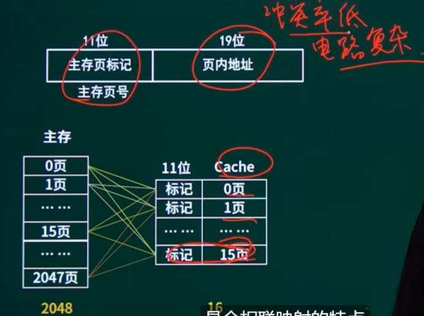

#### 组相联映像

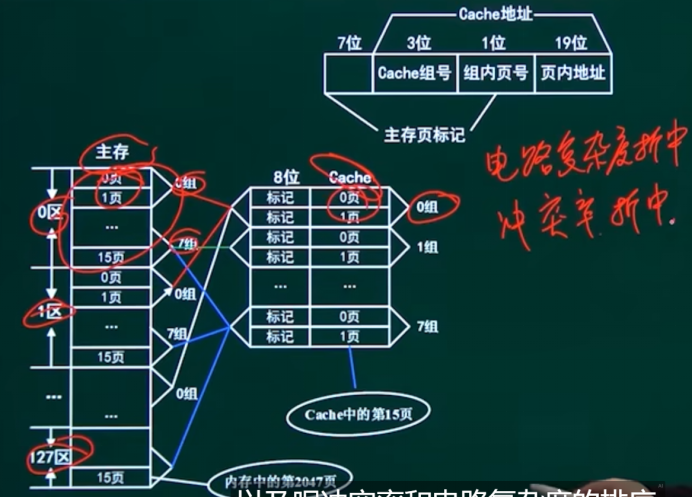

> ```tex
> 以下关于Cache（高速缓冲存储器）的叙述中，不正确的是（A）
> A.Cache的设置扩大了主存的容量
> B.Cache的内容是主存部分内容的拷贝
> C.Cache的命中率并不随其容量增大线性地提高
> D.Cache位于主存与CPU之间
> ```

#### 主存-编址与计算

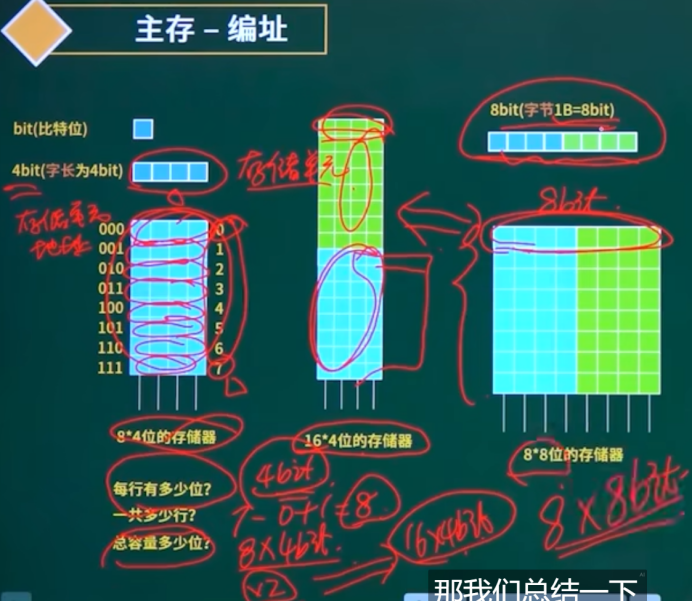

存储单元个数=最大地址-最小地址+1

编制内容

按字编址：存储体的存储单元是字存储单元bit，即最小寻址单位是一个字

按字节编址：存储体的存储单元是字节存储单元Byte，即最小寻址单位是一个字节

总容量=存储单元个数\*编址内容…………………………公式1

总片数=总容量/每片的容量………………………………公式2

根据地址范围和编址内容，可求总容量，公式1

已知总容量和片数，可求芯片容量

已知总容量和芯片容量，可求片数，公式2

> 1K=1KB=2^10^Byte，1M=1MB=2^20^Byte，1G=1GB=2^30^Byte
>
> 规律：题目如果说按字节编址，给出芯片容量是?K\*?bit
>
> 这时第一步是作差+1求出十六进制数字H（这时候单位是Byte）
>
> 若求多少KB字节，还要除以2^10^
>
> 若求片数，则分子分离出2^10^划掉（约掉下面的K），分母分离出8(bit)划掉（约掉上面的Byte）
>
> 若求芯片容量，则做除法后的单位是Byte，要转换成?K\*?bit的形式，需要分离处一个2^10^和一个8

> ```tex
> 内存按字节编址，地址从A0000H到CFFFFH的内存，共有（192KB）字节。若用存储容量为64K*8bit的存储器芯片构成该内存空间，至少需要（3）片。
> 
> 按字节Byte编址
> CFFFFH-A0000H+1=30000H
> ```
>
> $\dfrac{3*16^4Byte}{2^{10}Byte}=3*2^6=192KB$
>
> $\dfrac{3*16^4Byte}{64K*8bit}=\dfrac{3*2^6*2^{10}Byte}{2^6K*Byte}=3$

#### 数据传输控制方式

**程序控制（查询）方式**：分为无条件传送和程序查询方式两种。方法简单，硬件开销小，但I/O能力不高，严重影响CPU的利用率。

**程序中断方式**：与程序控制方式相比，中断方式因为CPU无需等待而提高了传输请求的响应速度。CPU与数据传输并行

**DMA方式**：Direct Memory Access，DMA方式是为了在主存与外设之间实现高速、批量数据交换而设置的。DMA方式比程序控制方式与中断方式都高效。

（DMAC向总线裁决逻辑提出总线请求；CPU执行完当前总线周期即可释放总线控制权。此时DMA响应，通过DMAC通知I/O接口开始DMA传输。）

**通道方式**

**I/O处理机**

从上到下，效率越来越高。

中断处理过程：

* CPU无需等待也不必查询I/O状态。

* 当I/O系统准备好以后，发出中断请求信号通知CPU；

* CPU接到中断请求后，保存正在执行程序的现场（保存现场，用栈），打断的程序当前位置即为断点；

* （通过中断向量表）转入I/O中的服务程序的执行，完成I/O系统的数据交换；

* 返回被打断的程序继续执行（恢复现场）。

* 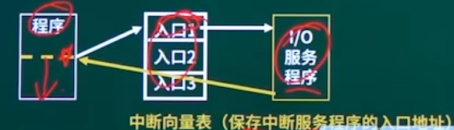

DMA不参与数据执行过程，程序查询方式对CPU利用率最低

> ```tex
> 计算机系统中常用的输入/输出控制方式有无条件传送、中断、程序查询和DMA方式等。当采用（A）方式时，不需要CPU执行程序指令来传送数据。
> A.中断 B.程序查询 C.无条件传送 D.DMA
> ```
>
> ```tex
> 计算机运行过程中，遇到突发事件，要求CPU暂时停止正在运行的程序，转去为突发事件服务，服务完毕，再自动返回原程序继续执行，这个过程称为（B），其处理过程中保存现场的目的是（C）
> A阻塞 B中断 C动态绑定 D静态绑定
> A防止丢失数据         B防止对其他部件造成影响
> C返回去继续执行原程序  D为中断处理程序提供数据
> ```
>
> ```tex
> CPU是在（一个时钟周期）结束时响应DMA请求的。
> ```

#### 总线

一条总线同一时刻仅允许一个设备发送，但允许多个设备接收。

总线的分类：

数据总线（Data Bus）：在CPU与RAM之间来回传送需要处理或是需要储存的数据。

地址总线（Address Bus）：用来指定在RAM（Random Access Memory）之中储存的数据的地址。

控制总线（Control Bus）：将微处理器控制单元（Control Unit）的信号，传送到周边设备。

> ```tex
> 以下关于总线的叙述中，不正确的是（C）
> A并行总线适合近距离告诉数据传输
> B串行总线适合长距离数据传输
> C单总线结构在一个总线上适应不同种类的设备，设计简单且性能很高
> D专用总线在设计上可以与连接设备实现最佳匹配
> ```

#### 系统可靠性分析-可靠性指标

平均无障碍时间MTTF=1/λ，λ为失效率

平均故障修复时间MTTR=1/μ，μ为修复率

平均故障间隔时间MTBF=MTTR+MTTF=故障修复时间+无故障时间

系统可用性=MTTF/(MTTR+MTTF)或=MTBF/(1+MTBF)，正确运行的概率

可靠性=MTTF/(1+MTTF)，无失效运作的效率

可维护性=1/(1+MTTR)，完成维护的概率

在实际应用中，一般MTTR很小，所以通常认为MTBF≈MTTF

> **记忆口诀：**MTTF简写为F(Fine)，MTTR简写为R(Repair)
>
> F=1/λ，R=1/μ，因为F与λ互为倒数，R与μ互为倒数，则λ=repair，μ=fine
>
> 因为系统总体可靠，所以fine=F=μ→∞，repair=R=λ→0
>
> 可靠性=F/(1+F)=1/(λ+1)
>
> 可用性=F/(R+F)=(R+F)/(1+R+F)         （交叉相乘不难验证两者近似相等）
>
> 可维护性=1/(1+R)=μ/(μ+1)
>
> 坏的上面永远有个1

#### 串联系统与并联系统

串联：R=R1\*R2\*...\*Rn  λ=λ1+λ2+...+λn

并联：R=1-(1-R1)\*(1-R2)\*...\*(1-Rn)  $\mu=\dfrac1{\dfrac1\lambda\sum_{i=1}^n\dfrac1j}$（不要求掌握）

#### 系统性能设计-性能指标

字长和数据通路宽度

主存容量和存取速度

运算速度

吞吐量与吞吐率

RT，Response Time，响应时间

TAT完成时间

兼容性

主频与CPU时钟周期

CPI，clock per instruction，平均每条指令的平均时钟周期个数

IPC，instruction per clock，每（时钟）周期运行指令条数

MIPS，Million Instructions Per Second，百万条指令每秒

MFLOPS，Million Floating-point Operations Per Second，每秒百万个浮点操作

$MIPS=\dfrac{指令条数}{执行时间*10^6}=\dfrac{主频}{CPI}=主频*IPC$

$MFLOPS=\dfrac{浮点操作次数}{执行时间*10^6}$

> ```tex
> 软件质量属性中，（吞吐量）是指软件每分钟可以处理多少个请求。
> ```
>
> ```tex
> 某计算机系统的CPU主频为2.8GHz。某应用程序包括3类指令，各类指令的CPI（执行每条指令所需要的时钟周期数）及指令比例如下表所示。执行该应用程序时的平均CPI为（3.5）；运算速度用MIPS表示，约为（800）。
> 
> 平均CPI：4*0.35+2*0.45+6*0.2=3.5
> MIPS=2.8*10^3/3.5=800
> ```
>
> |      | 指令A | 指令B | 指令C |
> | ---- | ----- | ----- | ----- |
> | 比例 | 35%   | 45%   | 20%   |
> | CPI  | 4     | 2     | 6     |

#### 操作系统

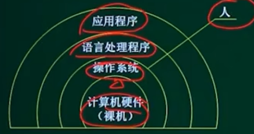

管理系统的硬件、软件、数据资源

控制程序运行

人机之间的接口

应用软件与硬件之间的接口

进程管理、存储管理、文件管理、作业管理、设备管理

> 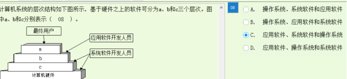

#### 特殊的操作系统

| 分类           | 特点                                                         |
| -------------- | ------------------------------------------------------------ |
| 批处理操作系统 | 单道批：一次一个作业入内存，作业由程序、数据、作业说明书组成；多道批：一次多个作业入内存，特点：多道、宏观上并行微观上串行 |
| 分时操作系统   | 采用时间片轮转的方式为多个用户提供服务，每个用户感觉独占系统。特点：多路性、独立性、交互性和及时性 |
| 实时操作系统   | 实时控制系统和实时信息系统。交互能力要求不高，可靠性要求高。（规定时间内响应并处理） |
| 网络操作系统   | 方便有效共享网络资源，提供服务软件和有关协议的集合。主要有：Unix、Linux和Windows Server系统 |
| 分布式操作系统 | 任意两台计算机可以通过通信交换信息。是网络操作系统的更高级形式，具有透明性、可靠性和高性能等特性。 |
| 微机操作系统   | Windows：Microsoft开发的图形用户界面、多任务、多线程操作系统。Linux：免费使用和自由传播的类Unix操作系统，多用户、多任务、多线程和多CPU的操作系统 |
| 嵌入式操作系统 | 运行在智能芯片环境中。特点：微型化、可定制（针对硬件变化配置）、实时性、可靠性、易一致性（HAL和BSP支持） |

#### 进程

进程是程序在一个数据集合上运行的过程，它是系统进行资源分配和调度的一个独立单位。它由程序块、进程控制块PCB和数据块三部分组成。

PCB：是进程存在的唯一标志。内容包含进程标识符、状态、位置信息、控制信息、队列指针（链接同一转台的进程）、优先级、现场保护区等。

#### 进程与程序

区别：进程是程序的一次执行过程，没有程序就没有进程。

#### 进程与线程

进程的2个基本属性：可拥有资源的独立单位；可独立调度和分配资源的基本单位

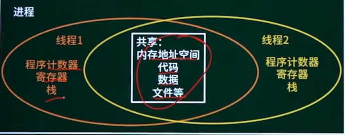

#### 进程管理-进程的状态

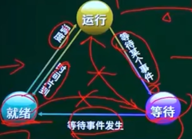

运行：当一个进程在CPU上运行时（单处理机处于运行态的进程只有一个）

就绪：一个进程获得了除CPU外的一切所需资源（非CPU资源），一旦得到处理机即可运行。

阻塞：阻塞也称等待或睡眠状态，一个进程正在等待某一时间发生（例如请求I/O等待I/O完成等）而暂时停止运行，此时即使把CPU分配给进程也无法运行，故称进程处于阻塞状态。

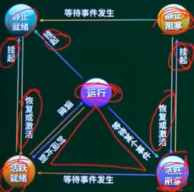

挂起原因：

（1）进程过多，主存资源不足，此时必须将某些进程挂起，放到磁盘对换区，暂时不参与调度，以平衡系统负载；

（2）系统出现故障，或者是用户调试程序，也可能需要将进程挂起检查问题。

> ```tex
> 在单处理机系统中，采用先来先服务调度算法。系统中有4个进程P1、P2、P3、P4（假设进程按此顺序到达），其中P1为运行状态，P2为就绪状态，P3和P4为等待状态，且P3等待打印机，P4等待扫描仪。若P1（A），则P1、P2、P3和P4的状态应分别为（C）。
> A时间片到 B释放了扫描仪 C释放了打印机 D已完成
> A等待、就绪、等待和等待 B运行、就绪、运行和等待
> C就绪、运行、等待和等待 D就绪、就绪、等待和运行
> ```
>
> ```tex
> P1为运行状态，P2为就绪状态，P3等待打印机，P4等待扫描仪。此时，若P1释放了扫描仪，则进程P1、P2、P3、P4的状态分别为（运行、就绪、等待、就绪）
> ```

#### 进程管理-进程的同步与互斥

临界资源：诸进程间需要互斥方式对其进行共享的资源（进程中访问临界资源的那段代码称为临界区）

互斥：如千军万马过独木桥 简介制约关系 P在前V在后

同步：并发，速度有差异，在一定情况停下等待 直接制约关系 V在前P在后

#### PV操作

信号量：是一种特殊的变量

信号量可以表示资源数量；

信号量为负数时还可以表示排队进程数

P是荷兰语的Passeren，V是荷兰语的Verhoog。

**遇到P操作，S减1；遇到V操作，S加1**

> ```tex
> PV操作是操作系统提供的具有特定功能的原语。利用PV操作可以（B）
> A保证系统不发生死锁 B实现资源的互斥使用
> C提高资源利用率 D推迟进程使用共享资源的时间
> ```

#### PV操作与互斥模型

多个进程共享一台打印机问题（互斥模型）：

```tex
P(S);
使用打印机；
V(S);
后续代码；
```

互斥信号量S的初值为1

#### PV操作与同步模型

单缓冲区生产者、消费者问题（同步模型）：

```tex
生产者：				消费者：
	生产一个产品；			P(S2);
	P(S1);				从缓冲区取产品；
	送产品到缓冲区；		V(S1);
	V(S2);				消费产品；
```

S1初值为1，S2初值为0

#### 互斥与同步模型结合

单缓冲区生产者、消费者问题（同步模型）：

```tex
生产者：				消费者：
	生产一个产品；			P(S2);
	P(S1);				P(S);
	P(S);				从缓冲区取产品；
	送产品到缓冲区；		V(S);
	V(S);				V(S1);
	V(S2);				消费产品；
```

同步信号量：S1初值为1，S2初值为0

互斥信号量：S初值为1

#### PV操作应用

必考题，S1到Sn一般顺序排列，圆圈前面是P，后面是V

第一步先判断是P还是V，有几个P，有几个V，不用管信号量，不能选出答案再看信号量

#### 死锁问题

死锁，是指两个以上的进程互相都要求对方已经占有的资源导致无法继续运行下去的现象

四大条件：互斥，保持和等待，不剥夺，环路等待；

死锁的预防（打破四大条件）：有序资源分配法，静态资源分配

死锁的避免：银行家算法

死锁的检测与解除

鸵鸟策略（不予理睬）

如果进程在等待一件不可能发生的事，则进程就死锁了。而如果多个进程产生死锁，就会造成系统死锁。

**系统不可能发生死锁的最小资源数  (w-1)\*m+1<=n**

m为进程，w为资源数

如：5个进程都需要4个系统资源，则——

n<4，必定死锁

n>=5\*3+1，不可能死锁

其他，可能死锁可能正常执行

#### 进程资源图

进程：⭕P；资源：$R1\fbox{⚪,⚪}$，内部有两个圆圈即有2个R1

$R1\fbox{⚪,⚪}\to⭕P$，R1👉P，资源R1已经分配给进程P，1个箭头即分配了1个R1

$R1\fbox{⚪,⚪}\leftarrow⭕P$，R1👈P，进程P申请1个资源R1，1个箭头即申请了1个R1，等待R1分配

步骤：

先分析资源分配情况，列出剩余可用资源：此时已分配1个R1个进程P，剩余1个R1可用。

在判断申请后进程是否能够执行：P进程申请1个R1，系统有1个R1可用，P进程可成功执行，执行后释放占用的2个R1

相关概念：阻塞结点/非阻塞结点/可化简/死锁

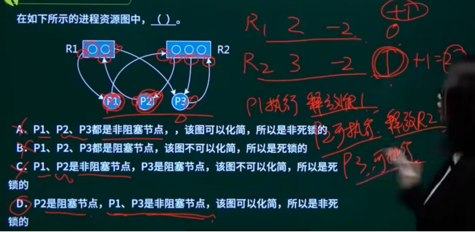

【先分配】R1分配出两个，有两个，还剩下0个；R2分配出2个，有三个，还剩下一个

【再申请】P1需要申请一个R2，R2刚好有一个，所以P1非阻塞；P2需要申请一个R1，R1没有了，所以P2阻塞；P3需要申请一个R2，R2刚好有一个，所以P3非阻塞。

此时先执行P1（也可以执行P3），释放了一个R1，还剩下0+1=1个R1。P2可执行（只需要申请一个R1），释放了一个R2，还剩下1+1=2个R2。P3可执行（只需要申请1个R2），故可以化简，非死锁

TIPS：没有请求的结点直接删去

#### 页式存储组织

页式存储：将程序与内存均划分为同样大小的块，以页为单位将程序调入内存。

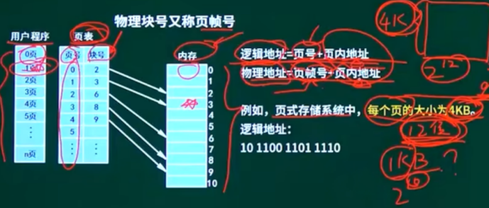

逻辑地址：10 1100 1101 1110（10二进制对应十进制的2）

对应的物理地址为：110 1100 1101 1110（110二进制对应十进制的6）

优点：利用率高，碎片小，分配及管理简单

缺点：增加了系统开销；可能产生抖动现象

淘汰页的原则和依据——①访问位为0；②多个访问位为0，修改位为0

> 页号：高级程序语言中使用
>
> 页帧号：内存中使用
>
> 状态位：1表示在内存中，0表示不在内存中
>
> 访问位：1表示最近访问过，0表示最近未被访问
>
> 修改位：1表示内容被修改过，0表示内容未被修改过

> | 页号（逻辑） | 页帧号（物理） | 状态位 | 访问位 | 修改位 |
> | ------------ | -------------- | ------ | ------ | ------ |
> | 0            | 2              | 1      | 1      | 0      |
> | 1            | 3              | 1      | 0      | 1      |
> | 2            | 5              | 1      | 1      | 0      |
> | 3            | -              | 0      | 0      | 0      |
> | 4            | -              | 0      | 0      | 0      |
> | 5            | 6              | 1      | 1      | 1      |
>
> 上面的例子，将会淘汰第3/4号页，因为访问位为0的有134页，当中34号页修改位为0

#### 页面置换算法

最优（Optimal，OPT）算法  理想型

随机（RAND）算法

先进先出（FIFO）算法：有可能产生“抖动”。例如，432143543215序列，用3个页面，比4个缺页要少

最近最少使用（LRU）算法：不会“抖动”，LRU的理论依据是“局部性原理”

时间局部性：刚被访问的内容，立即又被访问

空间局部性：刚被访问的内容，邻近的空间很快被访问。

> 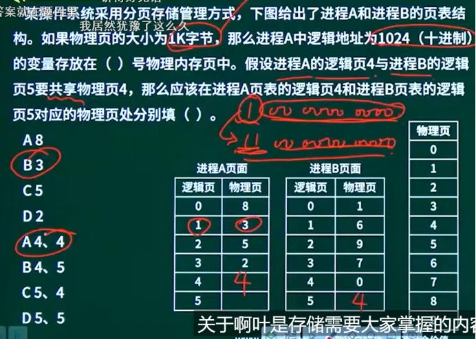
>
> ```tex
> 1K=2^10，后面10个位数不变；1024十进制转化为二进制是1 0000000000，后面10位不变，逻辑页1对应物理页的3
> ```

#### 段式存储组织

段式存储：按用户作业中的自然段来划分逻辑空间，然后调入内存，段的长度可以不一样。

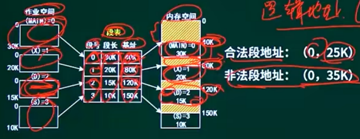

逻辑地址=段号+段内偏移量（其中段内偏移量不能超过段长）

优点：多道程序共享内存，各段程序修改互不影响

缺点：内存利用率低，内存碎片浪费大

> 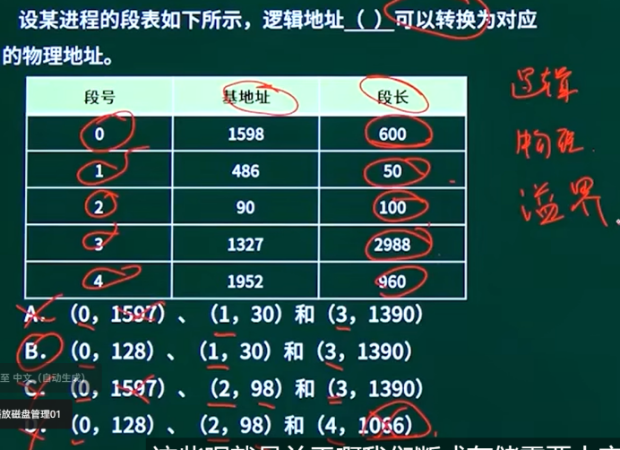
>
> 跟基地址没关系，只要满足段号的段长比最大段长小就行了

#### 磁盘管理

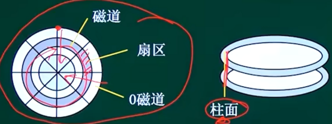

存取时间=寻道时间+等待时间，寻道时间是指磁头移动到磁道所需的时间；等待时间为等待读写的扇区转到磁头下方所用的时间。

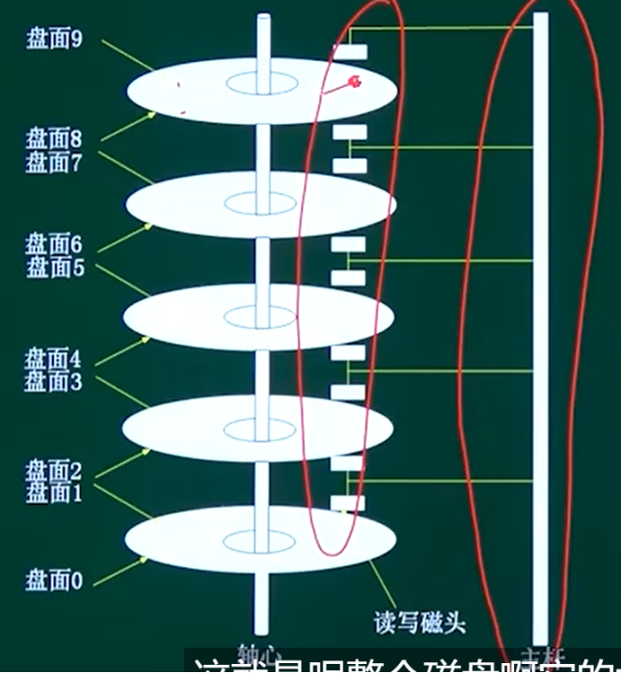

读取磁盘数据的时间应包括以下三个部分：

（1）找磁道的是按。

（2）找块（扇区）的时间，即旋转延迟时间。

（3）传输时间。

> ```tex
> 某磁盘磁头从一个磁道移至另一个磁道需要10ms。文件在磁盘上非连续存放，逻辑上相邻数据块的平均移动距离为10个磁道，每块的旋转延迟时间及传输时间分别为100ms和2ms，则读取一个100块的文件需要（20200）ms时间。
> 
> (10*10+100+2)*100
> ```

#### 磁盘调度

先来先服务FCFS，First Come First Serve

最短寻道时间优先SSTF，Shortest Seek Time First

扫描算法SCAN

循环扫描算法CSCAN

> 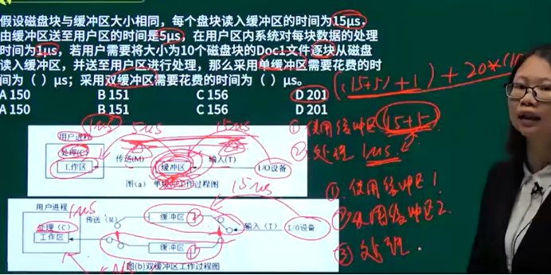
>
> 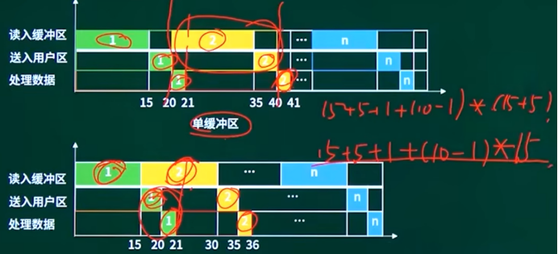
>
> 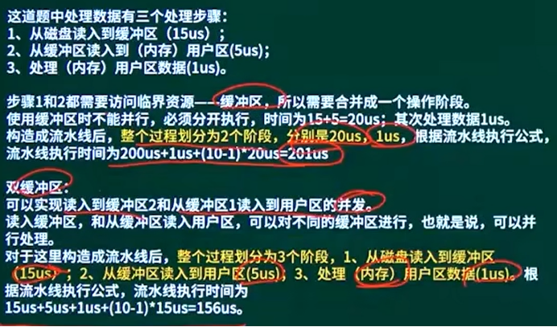

> 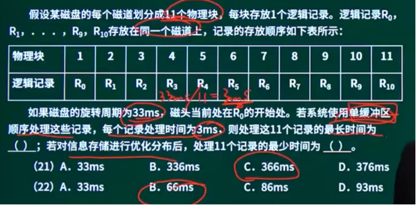
>
> 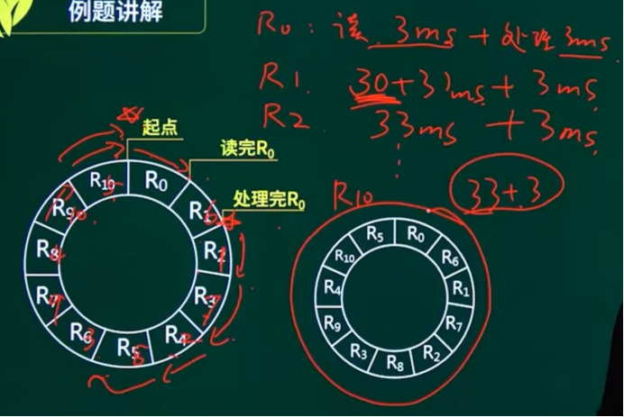
>
> 讲错了，第一空是336

#### I/O管理软件

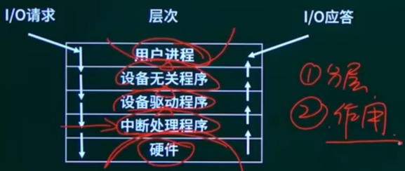

硬件：完成具体的I/O操作

中断处理程序：I/O完成后唤醒设备驱动程序

设备驱动程序：设置寄存器，检查设备状态

设备无关I/O层：设备名解析、阻塞进程、分配缓冲区

用户级I/O层：发出I/O调用

作用：为了屏蔽硬件

#### 文件

文件：具有符号名的、在逻辑上具有完整意义的一组相关信息项的集合。

逻辑结构：有结构的记录式文件、无结构的流式文件

物理结构：连续结构、链接结构、索引结构、多个物理块的索引表

文件目录：文件目录项/文件的说明/文件控制块FCB

基本信息类：文件名、文件的物理地址、文件长度和文件块数等

存储控制信息类：文件的存储权限：读写、执行权限等

（文件属性：只执行、隐含、只读、读/写、共享、系统）

使用信息类：文件建立日期、最后一次修改、访问日期、当前使用的信息、打开文件的进程数以及在文件上的等待队列等

目录结构

一级目录结构：线性结构，查找速度慢，不允许重名和实现文件共享等

二级目录结构：主文件目录MFD+用户目录UFD

三级目录结构：树型目录结构（多级目录结构）

> ```tex
> 若系统在将（A）文件修改的结果写回磁盘时发生崩溃，则对系统的影响相对较大。
> A目录 B空闲块 C用户程序 D用户数据
> ```

#### 树型目录结构

多级目录结构允许不同用户的文件可以具有相同的文件名

绝对路径：/开头

相对路径：没有/

全文件名：绝对路径+文件名

#### 文件管理-空闲存储空间的管理-位示图法

0/1表示空闲/占用

> ```tex
> 某字长为32位的计算机的文件管理系统采用位示图（bitmap）记录磁盘的使用情况。若磁盘的容量为300GB，物理块的大小为1MB，那么位示图的大小为（9600）个字。
> ```
>
> 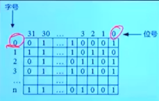
>
> 有多少磁盘需要管理：$\dfrac{300GB}{1MB}=300*2^{10}$
>
> $字数=\dfrac{磁盘容量}{位数}=\dfrac{300*2^{10}}{32}=9600$
>
> ```tex
> 2054号磁盘放在第几号字，第几个bit位？
> ```
>
> $2054/32=64\cdots6$，所以放在第65个编号，即编号64**号**字
>
> 64\*32=2048，第2054号字放在第2055个物理块，第64号字里面枚举：
>
> 第几个物理块  2049 2050 2051 2052 2053 2054 2055
>
> 第几号比特位      0		1		2		3		4		5
>
> 得出——第6**个**bit位置，编号为5
>
> 综上，2054号磁盘放在第64**号**字的第6**个**bit位上
>
> 结论：号永远比位少了1，商不变，余数不变

> 思考：物理块从0开始编号，某页面放置在1023号物理块，则如何操作？

#### 文件管理-索引文件结构

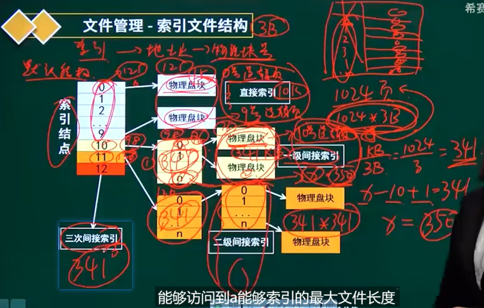

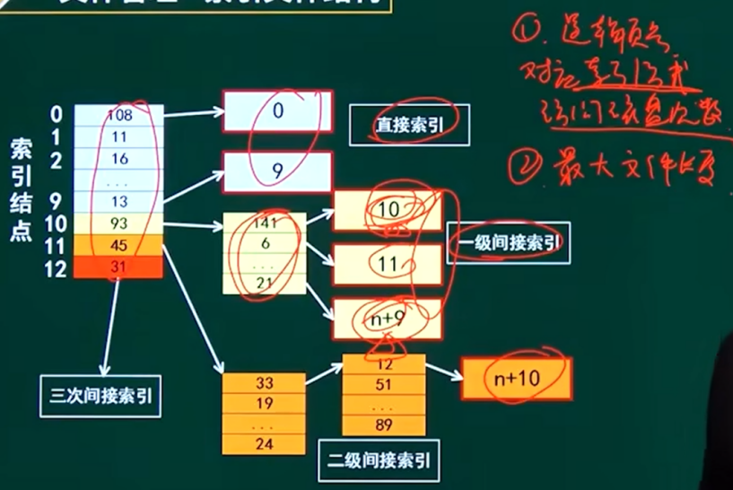

> 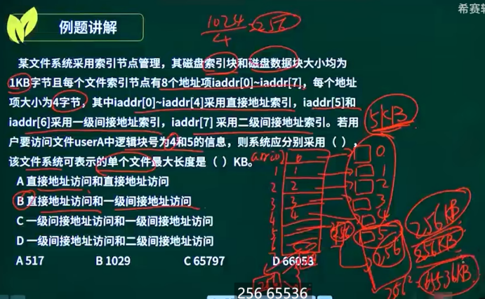
>
> 结论：最后一空，不会算，往大了选，选最大的

#### 作业状态与作业管理

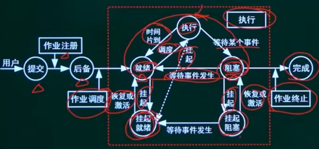

#### 作业调度算法

先来先服务法、时间片轮转法、短作业优先法、最高优先权优先法、高响应比优先法

响应比=（作业等待时间+作业执行时间）/作业执行时间

> 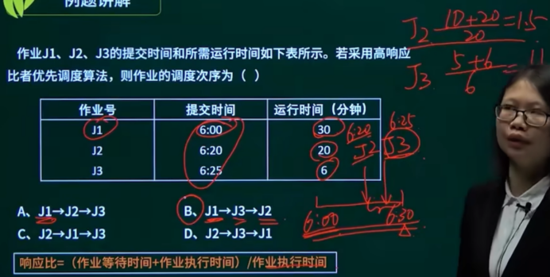
>
> ```tex
> 6点整的时候只有J1，但J1完成的时候是六点半，这时候已经有J2和J3了，这时候J2等了10分钟，J3等了5分钟，代入J2和J3的响应比可求得J3的大
> ```

#### 数据库系统的体系结构

集中式数据库系统

* 数据是集中的
* 数据管理是集中的
* 数据库系统的素有功能（从形式的用户接口到DBMS核心）都集中在DBMS所在的计算机

C/S结构

* 客户端负责数据表示服务
* 服务器主要负责数据库服务
* 数据库系统分为前端和后端
* ODBC、JDBC

分布式数据库

* 物理上分布、逻辑上集中、
* 物理上分布、逻辑上分布
* 特点
* 透明性

并行数据库

* 共享内存式
* 无共享式

#### 分布式数据库特点

数据独立性。除了数据的逻辑独立性与物理独立性外，还有数据分布独立性（分布透明性）

集中与自治共享结合的控制结构。各局部的DBMS可以独立地管理局部数据库，具有自治的功能。同时，系统又舍友集中控制机制，协调各局DBMS的工作，执行全局应用

适当增加数据冗余度。在不同的场地存储同一数据的多个副本，可以提高系统的可靠性和可用性，同时也能提高系统性能。

（提高系统的可用性，即当系统中某个节点发生故障时，因为数据有其他副本在非故障场地上，对其他所有场地来说，数据仍然是可用的，从而保证数据的完整性。）

全局的一致性、可串行性和可恢复性


#### 白盒测试用例设计方法

- **语句覆盖**：每条语句至少执行一次。（即走完所有的矩形和菱形）
- **判定覆盖**：每个判定的所有可能结果至少出现一次。（又称“分支覆盖”）（即走完所有的边）
- **条件覆盖**：每个条件的所有可能结果至少执行一次。**缺点**：**条件覆盖并不一定总能覆盖全部分支。**但是，**条件覆盖还是要比判定覆盖强一些**，因为条件覆盖可能会使判断中各个条件的结果都取“真”或着取“假”，而判定覆盖却做不到这一点。（跟边没关系了，可以把所有的边去掉，然后看菱形可以分出多少，矩形也可以删去）
- **判定/条件覆盖**：一个判定中的每个条件的所有可能结果至少执行一次，并且每个判断本身的所有可能结果至少执行一次。
- **多重条件覆盖**（组合覆盖）：每个判定中的所有可能的条件结果的组合，以及所有的入口点都至少执行一次。（注意“可能”二字，因为有些组合的情况难以生成。）
- **完全路径覆盖**：每条路径至少执行一次。
- **基本路径覆盖**：根据流图计算环复杂度，得到基本路径覆盖的用例数。
- **分割后的完全路径覆盖**：每条路径至少执行一次，每个条件的所有可能结果至少执行一次。

*覆盖程度*
路径覆盖 > 多重条件覆盖 > 判定/条件覆盖 > 条件覆盖 > 判定覆盖 > 语句覆盖
`1. 路径覆盖是覆盖率最高的。语句覆盖最弱。`
`2. 满足多重条件覆盖准则的测试用例集，同样满足判定覆盖准则、条件覆盖准则和判定/条件覆盖准则。`
**任何一种覆盖方法都无法实现完全的测试**。所以，在实际的测试用例设计过程中，根据需要将不同的覆盖方法组合起来使用，以实现最佳的测试用例设计 。

[相关链接](https://zhuanlan.zhihu.com/p/598840079?utm_id=0)

#### 数据流图总结


#### 实体联系图总结


#### UML图总结


#### java总结


#### C++总结


#### 上午考回顾

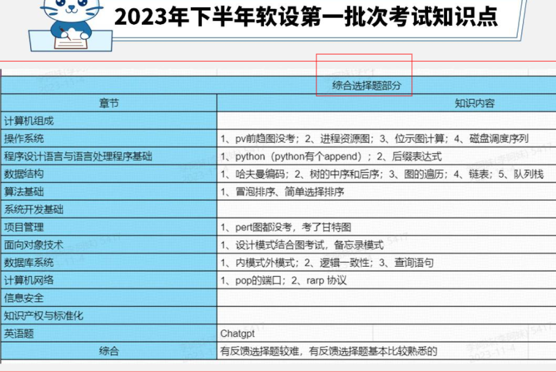

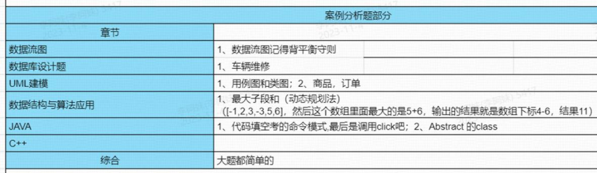

pop端口号：TCP端口110

记忆几个协议与端口号，TCP/UDP的对应关系：
DNS(域名系统) - UDP - 53
TFTP(简单文件传输协议) - UDP - 69
RPC(远程过程调用) - UDP - 111
SMTP(简单邮件传输协议) - TCP - 25
Telnet(远程连接) - TCP - 23
53 -> 午餐, 69 -> 牛角，111 -> 1,11 -> 衣+筷子， 25 -> 二胡，23 -> 骆驼
然后根据 TCP 可靠交付，UDP 尽最大努力交付的特点，可以把 TCP 抽象为准确、UDP 抽象为胡乱/失败。对每个要记忆的点，都编成一句话，因为是无需记忆，三个要素可以打乱顺序。然后可以用关联法编成一句话：

1. 在吃午餐(53)时，随机(UDP)给人命名(DNS)，
2. 被命名的人用简陋的文件传(TFTP)给我一个牛角(69)面包，我没收到(UDP)
3. 我用RPG(形近RPC)给被命名的人发射一件衣服和一双筷子(111)，没打中(UDP)
4. 被命名的人把二胡(25)塞进邮箱，然后成功(TCP)发送了给我，
5. 然后我精准(TCP)地遥控(Telnet)一只骆驼(23)给我演奏。


*RARP*：Reverse Address Resolution Protocol反向地址传输协议（位于网络层）

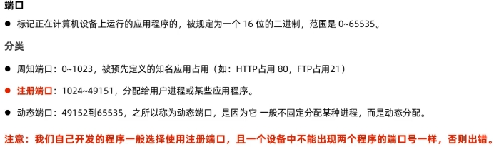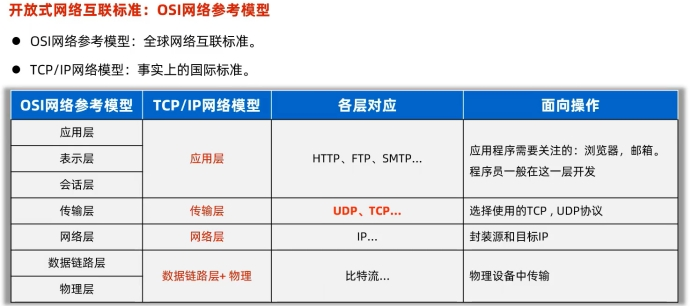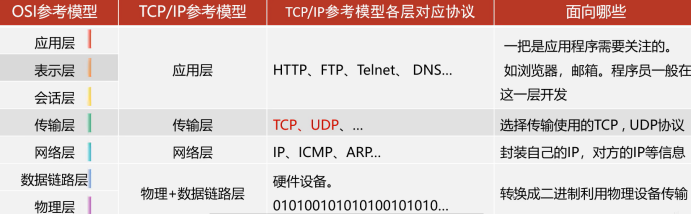


